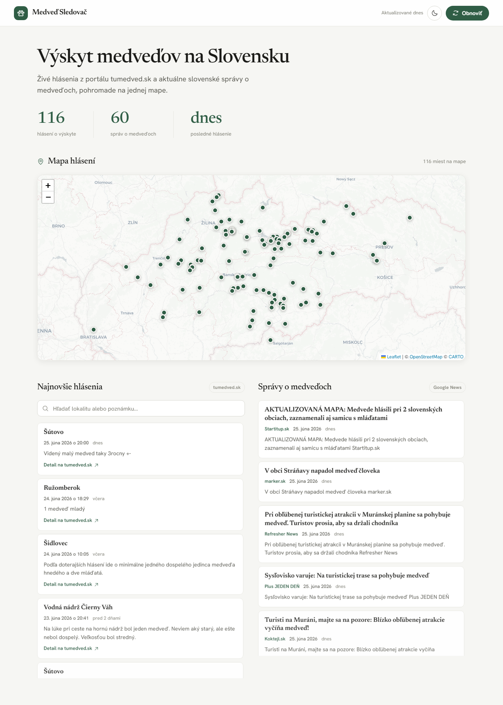
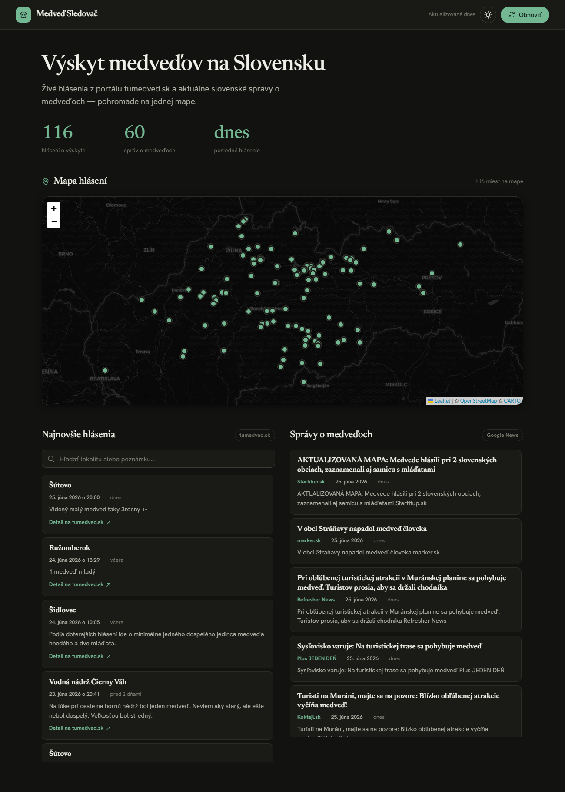

# 🐻 Medveď Sledovač

Web app, ktorá zbiera **hlásenia o výskyte medveďov** z viacerých verejných máp
a **slovenské správy o medveďoch**, a zobrazuje ich na jednom mieste — na interaktívnej
mape Slovenska a v prehľadných zoznamoch bez duplicitných udalostí.

> A web app that aggregates bear-sighting reports from several public maps and Slovak
> news, then displays deduplicated events on an interactive map of Slovakia.

| Svetlý režim | Tmavý režim |
|---|---|
|  |  |

## Čo to robí / What it does

- **Hlásenia o výskyte** – sťahuje hlásenia z tumedved.sk, používateľské hlásenia z
  mapamedvedov.sk a aktuálnu mapu sprejnamedveda.sk (lokalita, dátum, poznámka a GPS).
- **Zlučovanie mapových zdrojov** – podobné udalosti z máp porovná podľa dátumu, času,
  lokality, súradníc a komentára. Na mape ostane jeden bod s odkazmi na všetky zhodné
  mapové hlásenia. Spravodajské články sa s hláseniami nezlučujú. Zdroj
  sprejnamedveda.sk sa z každého bodu preklikáva iba na jeho stránku Aktuality.
- **Správy** – agreguje slovenské spravodajstvo o medveďoch z viacerých vyhľadávaní cez
  Google News (výskyt, útok, stretnutie turistu…), odstráni duplicity a zoradí podľa dátumu.
  Relevančný filter vyhodí články, ktoré medveďa len spomenú/odkazujú naň (medvedí výraz
  musí byť priamo v titulku alebo popise).
- **Geokódovanie správ** – z titulku/popisu článku sa rozpozná slovenská obec/mesto a správa
  sa zobrazí ako značka na mape. Funguje offline cez lokálny gazetteer (`src/geo/sk-places.json`)
  s toleranciou na slovenské skloňovanie (napr. „v Ružomberku" → Ružomberok).
- **AI predvyplnenie moderácie** – iba nové správy po stiahnutí spracuje cez OpenRouter model
  `google/gemma-4-31b-it:free`. Model predvolí „Správa / článok“ alebo „Medvedie varovanie“
  a pri varovaní doplní najpresnejšiu lokalitu; admin výsledok pred schválením skontroluje.
- **Mapa** – Leaflet + prepínateľné vrstvy: štandardná, turistická (OpenTopoMap) a satelitná
  (Esri). Kliknutie na hlásenie/správu v zozname vycentruje mapu na dané miesto. Dva druhy
  značiek: **hlásenia** z verejných máp a **správy** geokódované z textu článku.
- **Filtrovanie mapy podľa dátumu** – rozsah Od/Do filtruje značky na mape aj súvisiace zoznamy.
- **Vyhľadávanie** v hláseniach podľa lokality alebo poznámky.
- **Svetlý a tmavý režim** – prepínač v hlavičke, voľba sa pamätá; dá sa vynútiť aj cez
  URL parameter `?theme=light` / `?theme=dark`. Štandardná mapová vrstva mení dlaždice podľa
  režimu a zvolená vrstva mapy sa pamätá samostatne.
- **Serverové obnovovanie + Supabase** – scraping spúšťa externý cron job (cron-job.org),
  výsledky sa ukladajú do Supabase tabuliek a používatelia čítajú už pripravené dáta.

## Odkiaľ pochádzajú dáta / Data sources

| Zdroj | Ako | Endpoint |
|-------|-----|----------|
| **tumedved.sk** | oficiálne WordPress REST API (typ príspevku `vyskyt-medveda`) — žiadne krehké HTML scrapovanie | `https://tumedved.sk/wp-json/wp/v2/vyskyt-medveda` |
| **mapamedvedov.sk** | schválené príspevky používateľov vložené v dátach aktuálnej mapy | `https://mapamedvedov.sk/` |
| **sprejnamedveda.sk** | strojovo čitateľné dáta mapy; články sa interne párujú na kontrolu obsahu, verejný zdrojový odkaz vedie iba na Aktuality | `https://www.sprejnamedveda.sk/aktuality/` |
| **Slovenské správy** | Google News RSS pre viaceré dopyty, slovenská edícia (`hl=sk&gl=SK&ceid=SK:sk`) | `https://news.google.com/rss/search?q=…` |

## Spustenie / Run

Potrebuješ **Node.js 20+**.

```bash
npm install
npm start
```

Potom otvor **http://localhost:3000**.

Pred produkčným spustením vyplň `.env`:

```bash
SITE_URL=https://tvoja-domena.sk
SUPABASE_URL=https://your-project-ref.supabase.co
SUPABASE_SERVICE_ROLE_KEY=your-service-role-key
OPENROUTER_API_KEY=sk-or-v1-your-openrouter-key
# voliteľné, toto je predvolená hodnota:
OPENROUTER_MODEL=openrouter/free
WEBSITE_LOG_IP_SALT=replace-with-a-long-random-string
CRON_REFRESH_SECRET=replace-with-a-long-random-string
# voliteľné; predvolený kľúč je už publikovaný v /public:
INDEXNOW_KEY=03a59456ce8341fba7b18cf916aa32e8
```

`SITE_URL` musí byť presný verejný HTTPS origin bez cesty a bez lomky na konci.
Server ho používa pre kanonické URL, Open Graph, JSON-LD, sitemapu, RSS a `llms.txt`.
Ak nie je nastavený, lokálny vývoj použije origin aktuálnej požiadavky.

OpenRouter dostáva iba titulok, zdroj, krátky popis a extrahovaný text nového článku. Ak
`OPENROUTER_API_KEY` chýba alebo model zlyhá, scraping pokračuje bez AI predvyplnenia.

Ak appku hostuješ na Verceli a chceš pravidelný refresh cez cron-job.org, nastav v cron-job.org
volanie na:

```text
https://tvoja-domena.sk/api/cron/refresh?secret=CRON_REFRESH_SECRET
```

Táto URL spustí fresh scraping tumedved.sk a správ, uloží výsledky do Supabase a vráti JSON
odpoveď. Secret musí sedieť s hodnotou v `.env`. Po úspešnej obnove server odošle zmenené
hlavné a lokalitné URL do IndexNow, aby ich Bing a ďalšie zapojené vyhľadávače objavili rýchlejšie.

Databázové tabuľky vytvoríš jednorazovo SQL skriptom
[`docs/supabase-schema.sql`](docs/supabase-schema.sql) v Supabase SQL editore.

Vývojový režim s automatickým reštartom:

```bash
npm run dev
```

Iný port:

```bash
PORT=8080 npm start          # macOS/Linux
$env:PORT=8080; npm start    # PowerShell (Windows)
```

## API

Server poskytuje aj vlastné čisté JSON API:

| Endpoint | Metóda | Popis |
|----------|--------|-------|
| `/api/sightings` | GET | hlásenia o výskyte medveďov |
| `/api/news` | GET | slovenské správy o medveďoch |
| `/api/status` | GET | stav serverového obnovovania dát |
| `/api/cron/refresh?secret=...` | ALL | chránený endpoint pre cron-job.org, spustí fresh scraping |

## SEO / GEO / AEO po nasadení

Server poskytuje crawl-ready HTML, absolútne canonical odkazy, Open Graph/Twitter metadata,
schema.org (`WebSite`, `WebApplication`, `Dataset`, `FAQPage`, `Article`, breadcrumbs),
`/sitemap.xml`, `/robots.txt`, `/feed.xml` a `/llms.txt`. Domovská stránka vykresľuje
najnovšie hlásenia aj na serveri, takže hlavný obsah nie je závislý od vykonania JavaScriptu.
Pre lokality s aspoň dvomi relevantnými záznamami vytvára server unikátne prehľady pod
`/vyskyt-medveda/:lokalita`; sú zahrnuté v sitemape a aktualizujú sa spolu so zdrojovými dátami.

Po nasadení treba jednorazovo dokončiť kroky, ktoré sa nedajú urobiť v repozitári:

1. Nastaviť `SITE_URL` a presmerovať všetky HTTP/www varianty na jeden HTTPS hostname.
2. Overiť doménu v Google Search Console a Bing Webmaster Tools.
3. Odoslať `https://tvoja-domena.sk/sitemap.xml` a skontrolovať URL Inspection pre `/`,
   `/bezpecnost`, `/o-mape` a `/stats`.
4. Doplniť skutočné identifikačné a kontaktné údaje prevádzkovateľa v dokumente o súkromí.
5. Budovať legitímne odkazy a citácie: obce, turistické organizácie, správy národných parkov,
   regionálne médiá a dátové katalógy. Nekupovať odkazy ani nevytvárať doorway stránky.
6. Priebežne publikovať vlastné, metodicky vysvetlené analýzy dát a opravovať nepresné záznamy.

Lokálna kontrola technických SEO podmienok:

```bash
npm run check
```

Príklad odpovede `/api/sightings`:

```json
{
  "updatedAt": "2026-06-25T20:06:35.401Z",
  "count": 116,
  "items": [
    {
      "id": "tm-948",
      "source": "tumedved.sk",
      "location": "Šútovo",
      "note": "Videný malý medveď, asi 3-ročný",
      "lat": 49.15737,
      "lng": 19.0766,
      "hasCoords": true,
      "reportedAt": "2026-06-25T18:00:00.000Z",
      "url": "https://tumedved.sk/vyskyt-medveda/sutovo-25-06-2026/",
      "sourceLinks": [
        { "label": "tumedved.sk", "url": "https://tumedved.sk/vyskyt-medveda/sutovo-25-06-2026/" },
        { "label": "sprejnamedveda.sk", "url": "https://www.sprejnamedveda.sk/medvede-na-mape/" }
      ]
    }
  ]
}
```

## Štruktúra / Project structure

```
medved/
├── server.js              # Express server + API + servírovanie frontendu
├── src/
│   ├── scheduled-store.js # serverový refresh + pamäťová kópia dát
│   ├── ai/
│   │   └── news-classifier.js # OpenRouter klasifikácia nových správ + lokalita
│   ├── db/
│   │   ├── supabase.js    # Supabase klient zo serverového .env
│   │   └── repository.js  # ukladanie/čítanie hlásení, správ a webových logov
│   ├── geo/
│   │   ├── geocode.js          # rozpozná obec v texte správy (offline, tolerantné na skloňovanie)
│   │   ├── sk-places.json      # gazetteer: slovenské obce/mestá/regióny + súradnice
│   │   └── build-gazetteer.mjs # jednorazový build gazetteera cez Nominatim
│   └── scrapers/
│       ├── sightings.js       # nezávislé načítanie a zlúčenie mapových zdrojov
│       ├── tumedved.js        # hlásenia z tumedved.sk (WP REST API)
│       ├── mapamedvedov.js    # používateľské hlásenia z mapamedvedov.sk
│       ├── sprejnamedveda.js  # aktuálna mapa sprejnamedveda.sk
│       └── news.js            # slovenské správy (Google News RSS) + geokódovanie
└── public/
    ├── index.html         # frontend
    ├── styles.css
    └── app.js             # mapa (Leaflet) + zoznamy + vyhľadávanie
```

## Ako často sa dáta obnovujú / Refresh interval

- Scraping spúšťa **externý cron job** (cron-job.org) cez `/api/cron/refresh`.
- Server pri štarte načíta existujúce dáta zo Supabase a spustí počiatočnú obnovu.
- Zlúčené hlásenia sa ukladajú do historicky pomenovanej tabuľky `tumedved_logs`, správy do `news_logs`, behy scraperov do
  `scrape_runs` a návštevy/API requesty používateľov do `website_logs`.
- Frontend si dáta automaticky načíta každých 15 minút z API.

Supabase je povinný — bez neho server nemá odkiaľ čítať dáta.

## Poznámka / Disclaimer

Hlásenia na tumedved.sk pridávajú používatelia a **nemusia byť overené** — slúžia len ako
orientačná informácia. Táto app je nezávislý agregátor verejne dostupných dát a nie je
prepojená s tumedved.sk ani Google News.
