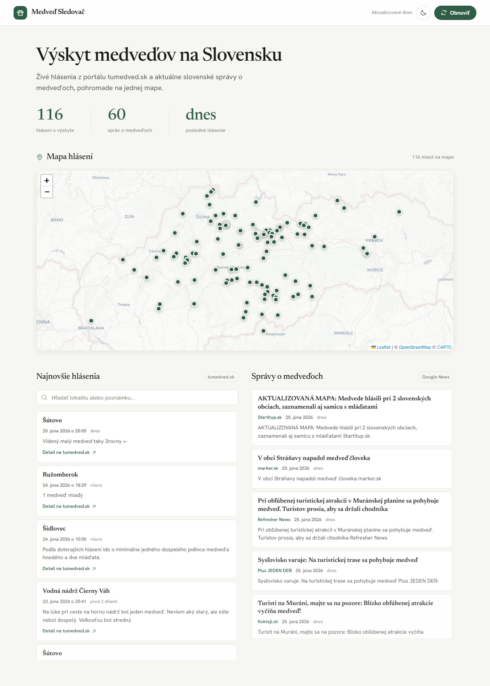
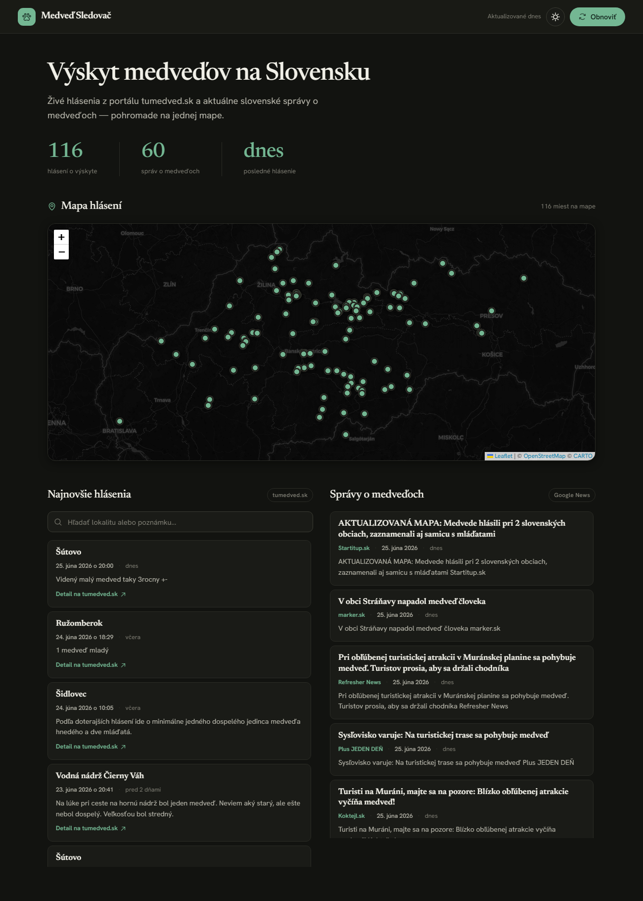

# 🐻 Kde je medveď

Web app pre mapový prehľad výskytu medveďov na Slovensku. Spája verejné hlásenia,
spravodajské články a vlastnú vrstvu moderácie do jednej mape a jedného zoznamu,
aby bolo vidieť, kde sa udalosti opakujú, kde sú duplicity a kde ide len o textovo
podobné záznamy.

Live site: kdejemedved.sk

> A web app that aggregates bear-sighting reports from several public maps and Slovak
> news, then displays deduplicated events on an interactive map of Slovakia.

| Svetlý režim | Tmavý režim |
|---|---|
|  |  |

## Čo to robí / What it does

- **Hlásenia o výskyte** – sťahuje hlásenia z tumedved.sk, používateľské hlásenia z
  mapamedvedov.sk a aktuálnu mapu sprejnamedveda.sk (lokalita, dátum, poznámka a GPS).
- **Zlučovanie mapových zdrojov** – podobné udalosti z máp porovná podľa dátumu, času,
  lokality, súradníc a komentára. Na mape ostane jeden bod s odkazmi na všetky zhodné
  mapové hlásenia. Spravodajské články sa s hláseniami nezlučujú. Zdroj
  sprejnamedveda.sk sa z každého bodu preklikáva iba na jeho stránku Aktuality.
- **Správy** – agreguje slovenské spravodajstvo o medveďoch z viacerých vyhľadávaní cez
  Google News (výskyt, útok, stretnutie turistu…), odstráni duplicity a zoradí podľa dátumu.
  Relevančný filter vyhodí články, ktoré medveďa len spomenú/odkazujú naň (medvedí výraz
  musí byť priamo v titulku alebo popise).
- **Geokódovanie správ** – z titulku/popisu článku sa rozpozná slovenská obec/mesto a správa
  sa zobrazí ako značka na mape. Funguje offline cez lokálny gazetteer (`src/geo/sk-places.json`)
  s toleranciou na slovenské skloňovanie (napr. „v Ružomberku" → Ružomberok).
- **AI predvyplnenie moderácie** – iba nové správy po stiahnutí spracuje cez OpenRouter model
  `openrouter/free`. Model predvolí „Správa / článok“ alebo „Medvedie varovanie“
  a pri varovaní doplní všetky spoľahlivo pomenované lokality jednotlivých pozorovaní;
  admin môže lokality pred schválením pridať, odstrániť alebo opraviť.
- **Udalosti a spravodajské pokrytie** – každý článok ostáva samostatným moderovaným
  záznamom, no admin ho môže pri schválení pripojiť k trvalej udalosti podľa skutočného
  dátumu a lokality. Verejný zoznam potom ukáže jednu udalosť s počtom zdrojov a rozbaliteľným
  pokrytím. Neisté zhody sa nikdy nepripájajú automaticky a možno ich schváliť bez spojenia.
- **Primárny zdroj udalosti** – poradie je založené na type zdroja, nie na všeobecnom
  hodnotení vydavateľa: úradné oznámenie, miestny alebo priamy zdroj, celoštátne médium,
  prevzatá správa a iný zdroj. Neskôr pridaný silnejší typ sa môže stať primárnym bez straty
  ostatných článkov. Viac médií samo osebe nemení udalosť na potvrdenú.
- **Automatická spam kontrola hlásení** – používateľské hlásenie s vysoko spoľahlivým výsledkom
  „legitímne“ sa hneď schváli; spam, neistý výsledok alebo nedostupná AI idú do moderácie.
  Záznamy z tumedved.sk, mapamedvedov.sk a sprejnamedveda.sk sa schvaľujú automaticky.
- **Mapa** – Leaflet + prepínateľné vrstvy: štandardná, turistická (OpenTopoMap) a satelitná
  (Esri). Kliknutie na hlásenie/správu v zozname vycentruje mapu na dané miesto. Dva druhy
  značiek: **hlásenia** z verejných máp a **správy** geokódované z textu článku.
- **Filtrovanie mapy podľa dátumu** – rozsah Od/Do filtruje značky na mape aj súvisiace zoznamy.
- **Vyhľadávanie** v hláseniach podľa lokality alebo poznámky.
- **Svetlý a tmavý režim** – prepínač v hlavičke, voľba sa pamätá; dá sa vynútiť aj cez
  URL parameter `?theme=light` / `?theme=dark`. Štandardná mapová vrstva mení dlaždice podľa
  režimu a zvolená vrstva mapy sa pamätá samostatne.
- **Serverové obnovovanie + Supabase** – scraping spúšťa externý cron job (cron-job.org),
  výsledky sa ukladajú do Supabase tabuliek a používatelia čítajú už pripravené dáta.
- **Telegram upozornenia a mobilná moderácia** – voliteľná, predvolene vypnutá
  integrácia používa trváci DB outbox, retry a súkromné schvaľovanie/zamietanie s auditom.
  Nastavenie je popísané v [`docs/telegram-notifications.md`](docs/telegram-notifications.md).
- **E-mailové upozornenia** – potvrdený odber (double opt-in), výber všetkých oblastí
  alebo konkrétnej lokality, trváci outbox, retry, ochrana pred duplicitami a odhlásenie
  jedným kliknutím. Nastavenie je v [`docs/email-notifications.md`](docs/email-notifications.md).

## Prehľad

Projekt je určený pre ľudí, ktorí chcú rýchlo skontrolovať aktuálne hlásenia o výskyte
medveďov, prečítať súvisiace správy a porovnať viac zdrojov naraz bez ručného preklikávania.
Zameriava sa na prehľadnosť, deduplikáciu a mapové zobrazenie namiesto jedného zdroja pravdy.

## Odkiaľ pochádzajú dáta / Data sources

| Zdroj | Ako | Endpoint |
|-------|-----|----------|
| **tumedved.sk** | oficiálne WordPress REST API (typ príspevku `vyskyt-medveda`) — žiadne krehké HTML scrapovanie | `https://tumedved.sk/wp-json/wp/v2/vyskyt-medveda` |
| **mapamedvedov.sk** | schválené príspevky používateľov vložené v dátach aktuálnej mapy | `https://mapamedvedov.sk/` |
| **sprejnamedveda.sk** | strojovo čitateľné dáta mapy; články sa interne párujú na kontrolu obsahu, verejný zdrojový odkaz vedie iba na Aktuality | `https://www.sprejnamedveda.sk/aktuality/` |
| **Slovenské správy** | Google News RSS pre viaceré dopyty, slovenská edícia (`hl=sk&gl=SK&ceid=SK:sk`) | `https://news.google.com/rss/search?q=…` |

## Ako funguje

- Dáta sa zbierajú z viacerých verejných zdrojov a ukladajú sa do vlastnej databázovej vrstvy.
- Podobné mapové hlásenia sa zlučujú, aby sa na mape nezobrazovali duplicity.
- AI pri nových správach oddeľuje dátum udalosti od publikovania a vyhľadá všetky spoľahlivé lokality.
- Admin časť podporuje moderáciu nových správ a používateľských hlásení; po schválení správy server automaticky pripojí jednoznačnú zhodu alebo vytvorí novú udalosť.
- Frontend je navrhnutý ako mapový prehľad s filtrami, vyhľadávaním a prepínaním vrstiev.

## Databázové migrácie

Pre novú databázu najprv spustite `docs/supabase-schema.sql` a potom migrácie
`docs/migration-006-news-incidents.sql` a `docs/migration-007-email-notifications.sql`
v Supabase SQL Editore. Pri existujúcej databáze ich po migráciách 001-005 spustite
v tomto poradí.

V SQL Editore spustite celý obsah migrácií bez označeného čiastkového výberu.
Editor pri označenom texte vykoná iba výber; telo PL/pgSQL funkcie by tak mohlo zostať
bez koncového oddeľovača. Migráciu možno po takomto prerušení bezpečne spustiť znova.

Migrácia 006 zámerne sama nerobí historický backfill ani spätne nespája staré správy.
Po jej nasadení možno najprv skontrolovať plán príkazom `npm run backfill:news-incidents`
a potom ho vykonať cez `npm run backfill:news-incidents -- --apply`. Skript je
obnoviteľný: spracúva iba schválené varovania, ktoré ešte nemajú incidentový odkaz.
Budúce spoľahlivé priradenia sa po schválení vyberú automaticky a ukladajú transakčne
cez serverový service-role klient; funkcia RPC nemá oprávnenie pre `anon` ani
`authenticated` rolu. Tá istá migrácia pridáva usporiadané lokality varovaní;
prvá lokalita zostáva zrkadlená v pôvodných stĺpcoch kvôli spätnej kompatibilite.

## Verejné zverejnenie

Tento repozitár môže byť verejný, ak v ňom nie sú uložené skutočné tajné údaje a ak sú
produkčné hodnoty mimo repozitára. Bezpečné je zverejniť zdrojový kód, dokumentáciu,
SQL schémy a verejné assety. Verejné nie je zverejňovať `.env`, service role kľúče,
API tokeny, admin heslá ani iné produkčné tajomstvá.

Pred publikovaním treba skontrolovať, že `.env` je ignorovaný, v git histórii nie sú
citlivé hodnoty a všetky použité kľúče sú prípadne zrotované.

## Poznámka / Disclaimer

Hlásenia na tumedved.sk pridávajú používatelia a **nemusia byť overené** — slúžia len ako
orientačná informácia. Táto app je nezávislý agregátor verejne dostupných dát a nie je
prepojená s tumedved.sk ani Google News.
